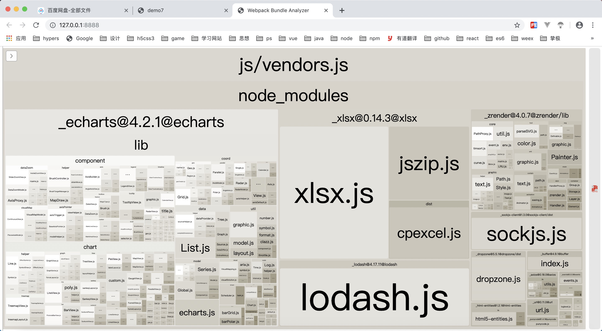
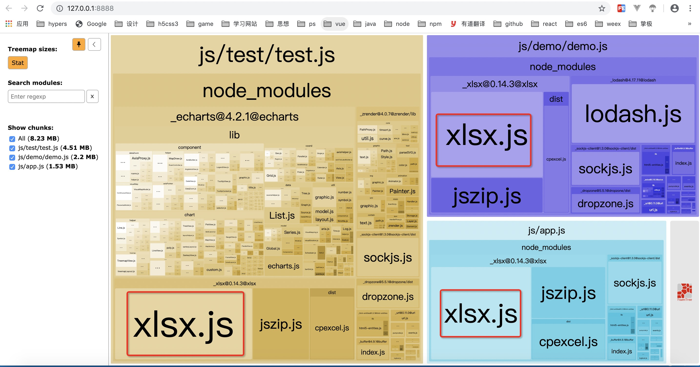
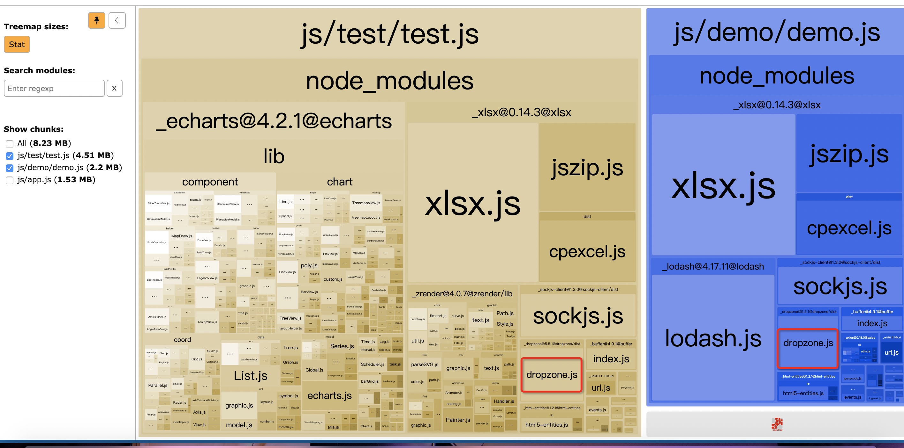
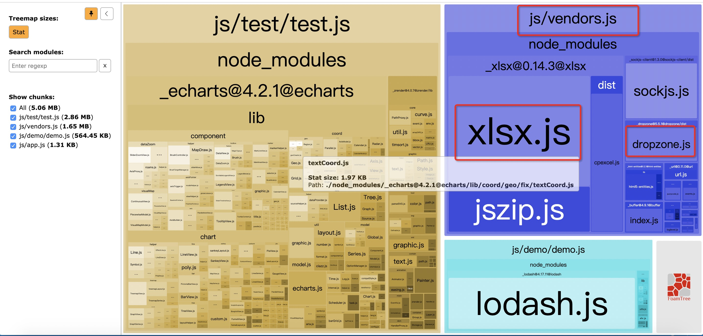

# 渐进式搭建webpack4配置

### demo7 新增包 
* **webpack-bundle-analyzer**
可视化显示打包的JS引用的包。



### demo7 文件更改
在app.js、test.js、home.js、都引入了 xlsx包
test.js 引入了dropzone、echarts包
home.js引入了axios、dropzone、lodash包

### demo7 配置更改
* **webpack.dev.conf.js**
使用webpack-bundle-analyzer插件
* **webpack.base.conf.js**
配置了 optimization.splitChunks。
```
 splitChunks: {
      chunks: "all", // 必须三选一： "initial" | "all"(推荐) | "async" (默认就是async)
      minSize: 30000, // 最小尺寸，30000
      minChunks: 1, // 最小 chunk ，默认1
      maxAsyncRequests: 5, // 最大异步请求数， 默认5
      maxInitialRequests: 3, // 最大初始化请求书，默认3
      automaticNameDelimiter: '~',// 打包分隔符
      cacheGroups: {
        vendors: { // 打包两个页面的公共代码
          minChunks: 2, // 引入两次及以上被打包
          name: 'vendors', // 分离包的名字
          chunks: 'all'
        },
      }
    }
```
webpack4主要更改的地方是取消了以前的CommonsChunkPlugin，使optimization.splitChunks进行分包

## splitChunks

#### chunks:

- all: 不管文件是动态还是非动态载入，统一将文件分离。当页面首次载入会引入所有的包
- async： 将异步加载的文件分离，首次一般不引入，到需要异步引入的组件才会引入。
- initial：将异步和非异步的文件分离，如果一个文件被异步引入也被非异步引入，那它会被打包两次（注意和all区别），用于分离页面首次需要加载的包。

#### minSize: 文件最小打包体积，单位byte，默认30000

比如说某个项目下有三个入口文件，a.js和b.js和c.js都是100byte，当我们将minSize设置为301,那么webpack就会将他们打包成一个包，不会将他们拆分成为多个包。

#### automaticNameDelimiter： 连接符

假设我们生成了一个公用文件名字叫vendor，a.js,和b.js都依赖他，并且我们设置的连接符是"~"那么，最终生成的就是 vendor~a~b.js

#### maxInitialRequests 入口点处的最大并行请求数，默认为3

如果我们设置为1，那么每个入口文件就只会打包成为一个文件

#### maxAsyncRequests 最大异步请求数量，默认5

如果我们设置为1，那么每个入口文件就只会打包成为一个文件

#### 优先级关系

maxInitialRequest / maxAsyncRequests <maxSize <minSize。

#### cacheGroups 定制分割包的规则

test可以配置正则和写入function作为打包规则。其他属性均可继承splitChunks，这里必须说一下**priority，设置包的打包优先级，非常重要！**（后面结合实践）

#### minChunks

最少引入的次数

## 实践

#####操作1
不配置splitChunks 直接运行
```
npm run dev
```



如图app.js、demo.js、test.js都有使用到xlsx这个包。并且进行了单独打包到各个js里面。
demo.js、test.js都有使用到dropzone这个包。并且进行了单独打包到各个js里面。
这就造成了代码的冗余，每次进入一个新的页面都会重新下载xlsx这个包的代码。
#####操作2
配置splitChunks 按照默认配置
```
   splitChunks: {
      chunks: "async", // 必须三选一： "initial" | "all"(推荐) | "async" (默认就是async)
      minSize: 30000, // 最小尺寸，30000
      minChunks: 1, // 最小 chunk ，默认1
      maxAsyncRequests: 5, // 最大异步请求数， 默认5
      maxInitialRequests: 3, // 最大初始化请求书，默认3
      automaticNameDelimiter: '~',// 打包分隔符
    }
```
效果和不配置是一样的。
#####操作3
配置splitChunks
```
    splitChunks: {
      chunks: "all", // 必须三选一： "initial" | "all"(推荐) | "async" (默认就是async)
      minSize: 30000, // 最小尺寸，30000
      minChunks: 1, // 最小 chunk ，默认1
      maxAsyncRequests: 5, // 最大异步请求数， 默认5
      maxInitialRequests: 3, // 最大初始化请求书，默认3
      automaticNameDelimiter: '~',// 打包分隔符
      cacheGroups: {
        vendors: { // 打包两个页面的公共代码
          minChunks: 2, //  注意点 引入两次及以上被打包
          name: 'vendors', // 分离包的名字
          chunks: 'all'
        },
      }
    }
```
plugs里面
```
    new htmlWebpackPlugin({
      filename: 'index.html',
      template: './index.html',
      inject: true,
      hash: true,
      chunks: ['vendors', 'app'] //新增 vendors分离包的名字
    }),
    
    function concatHtmlWebpackPlugin() {
      var entriesHtml = help.getEntry(['./src/module/**/*.html']);
      var res = [];
      for (var i in entriesHtml) {
        var html = entriesHtml[i];
        var obj = new htmlWebpackPlugin({
          filename: '.' + html.substring(html.lastIndexOf('/')),
          template: html, //html模板路径
          inject: true, //允许插件修改哪些内容，包括head与body
          hash: true,
          chunks: ['vendors',i]//i代表入口文件的key vendors代表拆包的文件
        })
        res.push(obj)
      }
      return res
    } 
```
```
npm run dev
```


打包后新增了 vendors.js
融合了xlsx、dropzone 这两个包
index.html、home.html、test.html都引入了vendors.js
app.js、test.js、home.js都不会再次引入。这个没次跳转下一个新页面就不会再次请求xlsx、dropzone这两个包的代码

**其实还是有问题的**
index.html里面并没有使用到dropzone这个包。这个demo8会分解。


```
npm run dev //开发
npm run build //打包
```